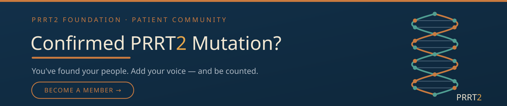

# Home

***


📱 On mobile? Tap ☰ in the top-left corner to browse all sections.


#### 🧭 Explore the Knowledge Base

<table data-view="cards"><thead><tr><th></th><th></th><th data-type="content-ref"></th><th data-hidden data-card-target data-type="content-ref"></th></tr></thead><tbody><tr><td><strong>📖 PRRT2 Gene Overview</strong></td><td>Start here — the gene, how it works, and the sodium channel science, in plain language.</td><td></td><td><a href="overview/introduction.md">introduction.md</a></td></tr><tr><td><strong>🧬 Associated Conditions</strong></td><td>PKD, BFIS, dystonia, dysphonia, tics, and more — the full spectrum explained.</td><td></td><td><a href="conditions/prrt2-spectrum.md">prrt2-spectrum.md</a></td></tr><tr><td><strong>🔬 Diagnosis &#x26; Genetic Testing</strong></td><td>How to get tested, what your results mean, and how to track your symptoms.</td><td></td><td><a href="diagnosis/how-to-get-tested.md">how-to-get-tested.md</a></td></tr><tr><td><strong>📝 Treatments &#x26; Management</strong></td><td>Medications, therapies, and management strategies — organized by treatment and by condition.</td><td></td><td><a href="treatments/how-treatment-works.md">how-treatment-works.md</a></td></tr><tr><td><strong>🧪 Research</strong></td><td>Current literature, clinical trials, and future therapeutics.</td><td></td><td><a href="research/current-literature.md">current-literature.md</a></td></tr><tr><td><strong>✍️ Expressions</strong></td><td>Our voice — deep dives on the issues that need more discussion than a reference page allows.</td><td></td><td><a href="https://www.prrt2.org/expressions">https://www.prrt2.org/expressions</a></td></tr><tr><td><strong>🤝 Living with PRRT2</strong></td><td>Daily management, caregiver guidance, triggers, and real patient stories.</td><td></td><td><a href="living/daily-management.md">daily-management.md</a></td></tr><tr><td><strong>📚 Resources</strong></td><td>Frequently asked questions, a plain-language glossary, a guide to bring to your doctor, and trusted links.</td><td></td><td><a href="resources/faq.md">faq.md</a></td></tr><tr><td><strong>🔭 Exploring the Wider Spectrum</strong></td><td>Dysphonia, tics, and the emerging edges of the PRRT2 phenotype — where the science is still being written.</td><td></td><td><a href="wider-spectrum/README.md">README.md</a></td></tr></tbody></table>

***

#### 🤝 Join the PRRT2 Foundation

<figure></figure>

Have a confirmed PRRT2 diagnosis? Signing up takes just a few minutes — **your name is never shared, only de-identified data.** Membership powers **research collaborations**, **new partnerships**, and **clinical trials**, and members are the **first to hear** as they open. Every person counted makes this community's voice harder to ignore.

<a href="https://intake.prrt2.org" class="button primary">✋ Get Counted — Join the Foundation</a>

***

<a href="https://donate.prrt2.org" class="button primary">💛 Donate Now</a>

***

#### 🏛️ PRRT2 Gene Foundation

<table data-view="cards"><thead><tr><th></th><th></th><th data-hidden data-card-target data-type="content-ref"></th></tr></thead><tbody><tr><td><strong>📖 About — The Reality of PRRT2</strong></td><td>The story behind this site, who built it, why it exists, and what drives the Foundation's work.</td><td><a href="about.md">about.md</a></td></tr><tr><td><strong>✍️ Expressions</strong></td><td>Our self-written articles — essays and lived-experience pieces, the Foundation's own voice, distinct from the clinical reference pages.</td><td><a href="https://www.prrt2.org/expressions">https://www.prrt2.org/expressions</a></td></tr><tr><td><strong>📬 Newsletter</strong></td><td>Stay updated — Foundation news, research updates, and community milestones, straight to your inbox.</td><td><a href="https://newsletter.prrt2.org">https://newsletter.prrt2.org</a></td></tr></tbody></table>

***

> **Our Mission:** The PRRT2 Foundation exists to do what a diagnosis alone cannot — explain this condition completely, connect the people living with it, forge the partnerships that accelerate research and expand access to testing, and build the technology that gives every patient a clinical voice.

Whether you're a patient, a caregiver, a researcher, or a clinician encountering PRRT2 for the first time — this is a rigorously cited knowledge base built by people who live with this gene. Real science in plain language.

***

#### 🤝 You're Not Alone

Living with a PRRT2 Gene Mutation isn't only a scientific problem — it's the misdiagnoses, the unanswered questions, and the symptoms nobody could explain. You don't have to navigate it alone.

Our community Facebook group is active and open. Ask questions, share your experience, and connect with others who understand what this condition actually does to a life.



***

#### 💛 Support Our Work


**PRRT2 Foundation, Inc.** is a recognized 501(c)(3) tax-exempt public charity. EIN: 42-3128330. Donations are tax-deductible to the full extent permitted by law.

A COPY OF THE OFFICIAL REGISTRATION AND FINANCIAL INFORMATION MAY BE OBTAINED FROM THE DIVISION OF CONSUMER SERVICES BY CALLING TOLL-FREE (800-435-7352) WITHIN THE STATE. REGISTRATION DOES NOT IMPLY ENDORSEMENT, APPROVAL, OR RECOMMENDATION BY THE STATE. Registration #CH83944.


<a href="https://donate.prrt2.org" class="button primary">💛 Donate Now</a> 

_Verified 501(c)(3) — view our Candid Seal of Transparency profile._

***

**Can't find what you're looking for?** The search bar above has AI built in, or click below to ask directly.

<button type="button" class="button primary" data-action="ask" data-icon="gitbook-assistant">Ask a question...</button>
