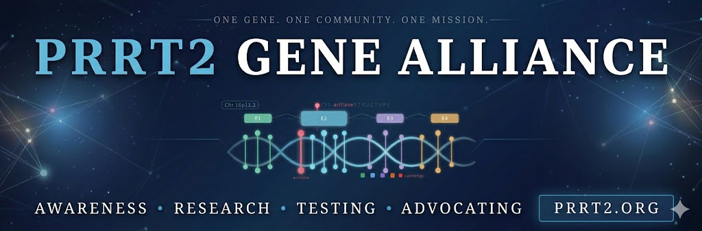

# PRRT2 Gene Alliance

<figure><figcaption></figcaption></figure>

<button type="button" class="button primary" data-action="ask" data-icon="gitbook-assistant">Ask a question...</button>


**PRRT2 Gene Alliance** is officially in Phase 1. We are currently laying the groundwork and building out the ultimate open-source knowledge base for the PRRT2 gene. Right now there are areas of information we will be tightening up and zoning in on ['Our Perspectives'](how-to-read.md#the-prrt2.org-perspective), but all information is in line with current published medical data. The site is under construction, the community is open. [Join us on the ground floor.](https://facebook.com/groups/prrt2) 🧬


#### New here? Start with [**The Reality of PRRT2**](about.md) — our story, and why this exists.

***

## 🧭 Explore the Knowledge Base

<table data-view="cards"><thead><tr><th></th><th></th><th data-hidden data-card-target data-type="content-ref"></th></tr></thead><tbody><tr><td><strong>📖 PRRT2 Gene Overview</strong></td><td>Start here — the gene, how it works, and the sodium channel science, in plain language.</td><td><a href="overview/introduction.md">introduction.md</a></td></tr><tr><td><strong>🧬 Associated Conditions</strong></td><td>PKD, BFIS, dystonia, dysphonia, tics, and more — the full spectrum explained.</td><td><a href="conditions/prrt2-spectrum.md">prrt2-spectrum.md</a></td></tr><tr><td><strong>🔬 Diagnosis &#x26; Genetic Testing</strong></td><td>How to get tested, what your results mean, and how to track your symptoms.</td><td><a href="diagnosis/how-to-get-tested.md">how-to-get-tested.md</a></td></tr><tr><td><strong>📝 Treatments &#x26; Management</strong></td><td>Medications, therapies, and management strategies — organized by treatment and by condition.</td><td><a href="treatments/how-treatment-works.md">how-treatment-works.md</a></td></tr><tr><td><strong>🧪 Research</strong></td><td>Current literature, clinical trials, and where the science is heading next.</td><td><a href="research/current-literature.md">current-literature.md</a></td></tr><tr><td><strong>🤝 Living with PRRT2</strong></td><td>Daily management, caregiver guidance, triggers, and real patient stories.</td><td><a href="living/daily-management.md">daily-management.md</a></td></tr><tr><td><strong>📚 Resources</strong></td><td>A plain-language glossary, a guide to bring to your doctor, and trusted links and support.</td><td><a href="resources/glossary.md">glossary.md</a></td></tr><tr><td></td><td></td><td></td></tr></tbody></table>

***

> **Our Mission:** To provide a comprehensive, scientifically-grounded hub for education, research tracking, and community support for all things related to the PRRT2 gene.

Whether you're a patient, a caregiver, a researcher, or someone newly diagnosed and searching for answers — this is a space built to help you understand PRRT2 clearly and completely. Real science, explained in plain language, alongside the human side of what this gene does to a life.

## 🤝 You're Not Alone

Living with PRRT2 isn't only a scientific problem — it's the misdiagnoses, the unanswered questions, and the symptoms nobody could explain. You don't have to navigate it alone.

Our community Facebook group is active and open. Ask questions, share your experience, and connect with others who understand what this condition actually does to a life.



***

**Need help navigating?** Use the search bar at the top of the page, or click **Ask a question** above to search the knowledge base directly.

