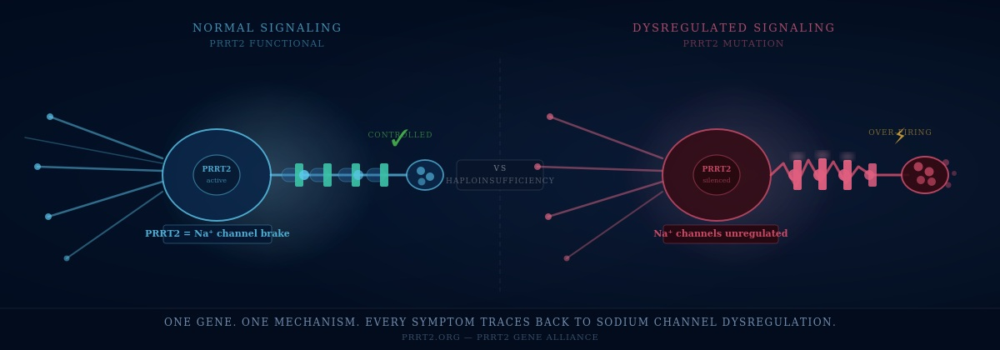

# About — The Reality of PRRT2

My name is Sean. I have a confirmed PRRT2 gene mutation — discovered later in life after decades of searching for answers.

If you search PRRT2 online today, you'll find brief clinical descriptions focused almost entirely on infants and young children. What you won't find is the reality that many of us lived with undiagnosed PRRT2 for years, even decades — collecting misdiagnoses, trying medications that didn't fit, and being treated for symptoms that nobody ever connected to a single cause.

PRRT2 isn't only a childhood condition. Many adults live with active symptoms that were never correctly diagnosed. Many more carry the mutation without ever being tested. The people living with it deserve more than a one-paragraph summary written for pediatric neurologists.

***

## A Wide Spectrum

PRRT2 presents across a wide spectrum. Some people experience seizure-like episodes. Others live with movement disorders, voice changes, tics, or paroxysmal events that defy easy categorization. Many receive multiple diagnoses across multiple specialties before anyone connects the dots.

This group exists to help close that gap. Some carriers never develop symptoms at all. For those who do, presentations range from mild and infrequent to more complex. Wherever you fall on that spectrum — you belong here.

***

## One Gene. One Mechanism.

> _PRRT2 is a small protein that acts as a brake on voltage-gated sodium channels throughout the nervous system. When one copy of that gene is silenced — which is what happens in most of us — those channels run without adequate regulation._
>
> _Every symptom traces back to that single mechanism._

<figure><figcaption>
Left: normal PRRT2 function keeps sodium channels regulated. Right: one silenced copy removes the brake — channels over-fire, producing every symptom in the PRRT2 spectrum.
</figcaption></figure>

I started the PRRT2 Foundation because patients and families deserve more than what currently exists — real science explained in plain language, and a community that understands what this condition actually does to a life.

***

## Our Goals as an Organization

The PRRT2 Foundation was founded by a patient who understood firsthand that no adequate resource existed for this community. Not for patients trying to understand what was happening to their bodies. Not for families trying to help. Not for clinicians encountering atypical presentations they had never seen before.

We operate as a patient-led nonprofit organization with the following commitments:

### 🔬 Knowledge

Produce and maintain the most comprehensive, rigorously cited, plain-language resource on PRRT2 available anywhere — covering genetics, associated conditions, diagnosis, treatment, research, and lived experience. Written for patients first, useful for clinicians.

### 🌐 Community

Build and support the first dedicated PRRT2 patient registry — through our partnership with CoRDS at Sanford Health — built for every stage of this condition: newly diagnosed infants and the families raising them, children as symptoms emerge and shift, and adults with atypical or late-diagnosed presentations who remain underrepresented in the clinical literature today.

### 🛠️ Technology

Develop tools that give PRRT2 patients a clinical voice:

* **A visual disease explainer** — animated cellular and neurological graphics showing what PRRT2 dysfunction actually looks like in motion
* **A PRRT2-specific symptom tracker** — designed around the real constellation, not generic symptoms; exports a clinical summary for neurology appointments
* **A diagnostic navigator** — maps a patient's symptom history against known PRRT2 presentations and generates language to bring to a physician

Because understanding your own condition — and being able to communicate it — should not take decades.

### 🧬 Access

Partner with genetic testing laboratories to reduce financial barriers to PRRT2 diagnosis for uninsured and underinsured patients.

### 🏛️ Advocacy

Represent the PRRT2 community in conversations with researchers, clinicians, pharmaceutical developers, and policymakers — and ensure that lived patient experience shapes how PRRT2 is understood, studied, and treated.


**🧭 Foundation Note**

The PRRT2 Foundation is a patient-founded, patient-led organization. These goals reflect the gaps we have lived — not gaps identified from the outside.


***

## You Belong Here

Living with PRRT2 isn't just a scientific problem. For patients, it's missed opportunities, misdiagnoses that followed you for years, relationships affected, and careers shaped around symptoms people couldn't explain or see. For parents, it's watching your child go through an episode you can't stop, sitting through appointment after appointment hoping someone has finally heard of this gene, and carrying a quiet fear for their future that no lab result can answer.

We will cover the science here — but we will never leave out the human side of what this gene does to a real life, at any age.


If you were told your symptoms are unrelated, unexplained, or untestable — this group is especially for you. A simple genetic test can change everything.


Whether you have PKD, BFIS, dystonia, epilepsy, dysphonia, PED, you're watching your child go through it, or you're newly diagnosed and overwhelmed — you belong here.

Join the PRRT2 Foundation Facebook group, introduce yourself, and tell us your diagnosis, your country, and your biggest unanswered question. Let's start mapping this condition together.

[**Join the PRRT2 Foundation →**](https://facebook.com/groups/prrt2)

***


**PRRT2 Foundation, Inc.** is a Florida nonprofit corporation.


***

— **Sean**\
Founder, PRRT2 Foundation\
[prrt2.org](https://prrt2.org)
