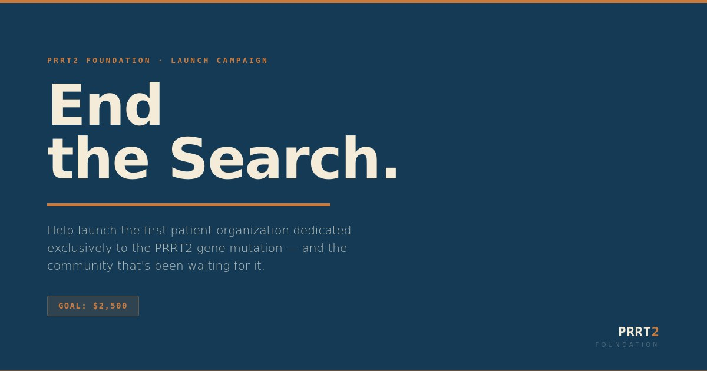

# Support Our Work

PRRT2 Foundation is the first organization built exclusively around this gene mutation. Most people living with a PRRT2 diagnosis spend years — sometimes decades — searching for answers that didn't exist. We're building them. A dedicated knowledge base, a patient registry, and the research partnerships that put PRRT2 on the clinical map. None of it happens without support.

***

## Make a Donation

<figure></figure>

Help launch the first patient organization dedicated exclusively to the PRRT2 gene mutation. Your gift funds year one — the knowledge base, patient registry groundwork, and research outreach every PRRT2 patient deserves.

<a href="https://donate.prrt2.org" class="button primary" style="font-size: 18px; padding: 14px 36px;">💛 Donate Now</a>

***

## Other Ways to Give

**By check** — Make payable to *PRRT2 Foundation, Inc.* and [contact us](resources/contact.md) for our mailing address.

**Bank transfer** — [Contact us](resources/contact.md) directly for wire or ACH details.

**Stock, crypto & donor-advised funds** — Coming soon. [Get in touch](resources/contact.md) if you'd like to give this way now.

***


**PRRT2 Foundation, Inc.** is a recognized 501(c)(3) tax-exempt public charity. EIN: 42-3128330. Donations are tax-deductible to the full extent permitted by law.

A COPY OF THE OFFICIAL REGISTRATION AND FINANCIAL INFORMATION MAY BE OBTAINED FROM THE DIVISION OF CONSUMER SERVICES BY CALLING TOLL-FREE (800-435-7352) WITHIN THE STATE. REGISTRATION DOES NOT IMPLY ENDORSEMENT, APPROVAL, OR RECOMMENDATION BY THE STATE. Registration #CH83944.



**A note on GiveButter fees:** During checkout, GiveButter may prompt you to add an optional tip to support their platform. This tip goes to GiveButter, not PRRT2 Foundation. You can set it to $0 — your full donation reaches us directly either way.

